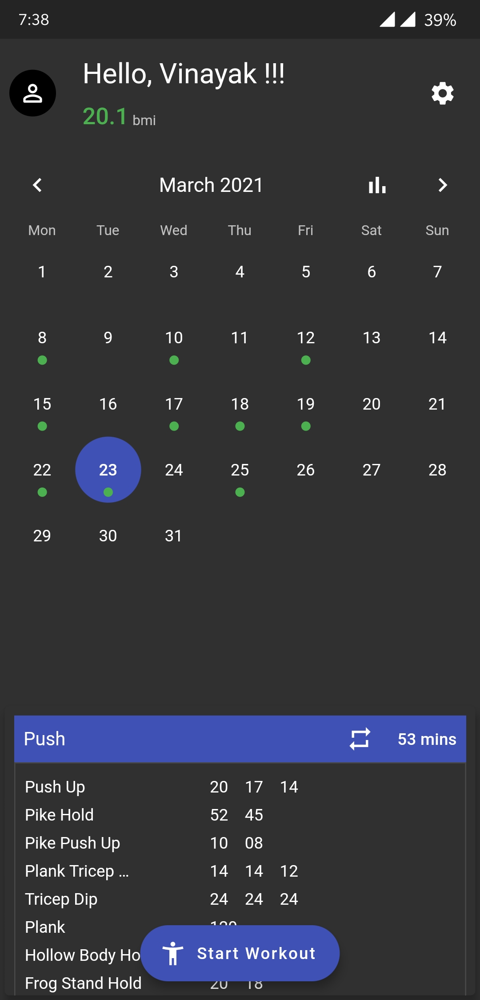
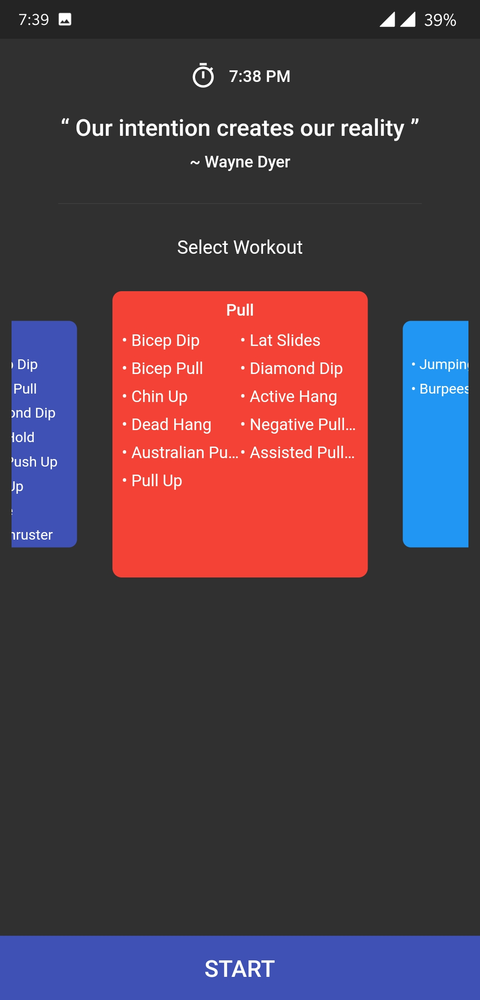
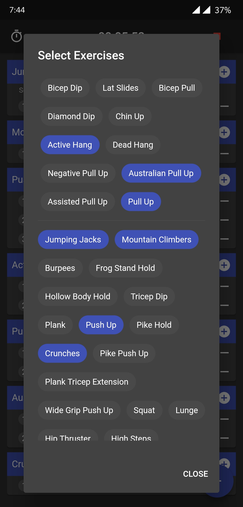
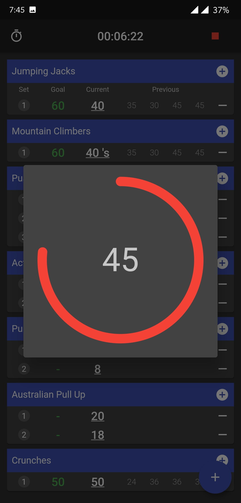
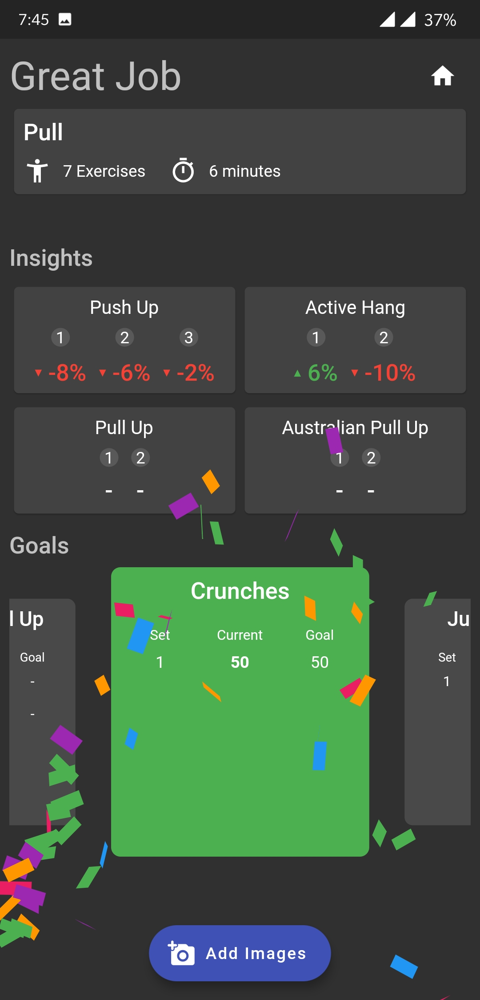
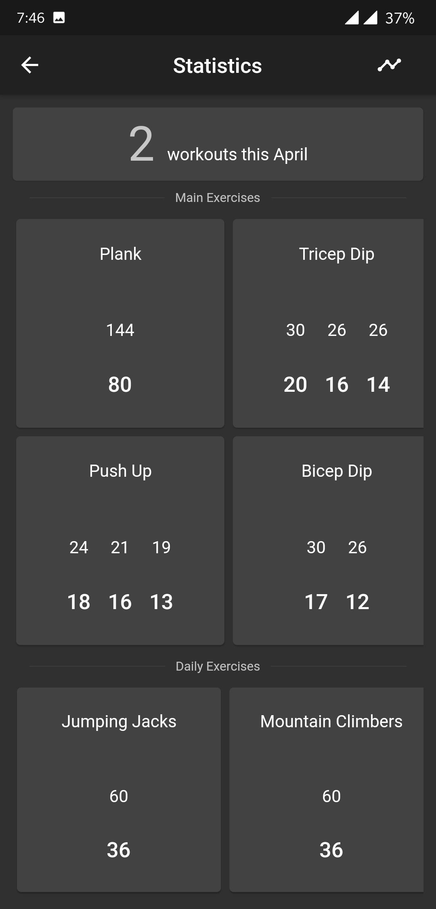
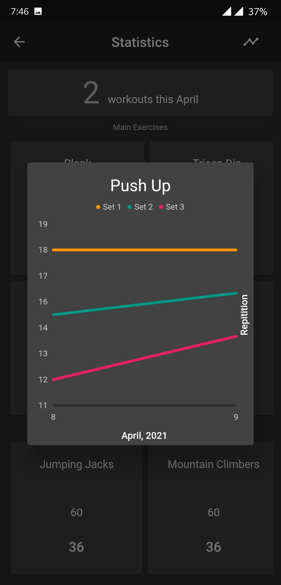
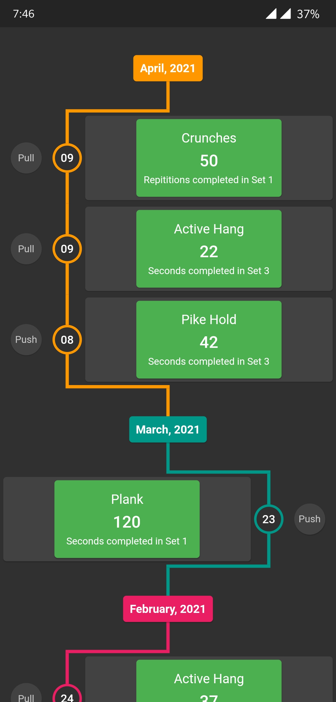
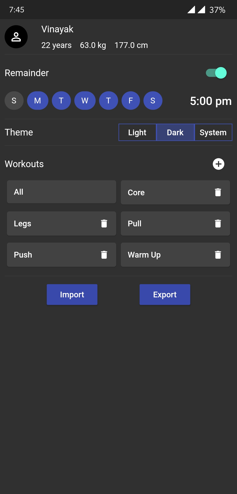

# flutter-workout-tracker

A simple workout tracker app developed using flutter

Features:
    Create custom workouts
    Create custom exercises
    Calendar View
    Monthly statistics
    Progress view
    Timeline
    Custom reminder

Please use Dark Mode as of now

Screenshots:

• Dashboard:

• New-Workout:

• Current-Workout:

• Add-Exercise.:

• Timer:

• Finish-Workout:

• Statistics:

• Progress:

• Timeline:

• Settings:

The default project contains some hardcoded workouts and exercises. Can be found in assets/data/database_inital/

Also you can import/export you data from settings