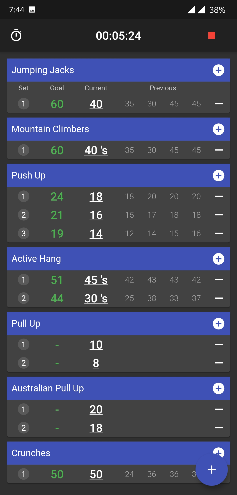

# flutter-workout-tracker

A simple workout tracker app developed using flutter

Features:
- Create custom workouts
- Create custom exercises
- Calendar View
- Monthly statistics
- Progress view
- Timeline
- Custom reminder

Please use Dark Mode as of now

Screenshots:

• Dashboard: 

• New-Workout: 

• Current-Workout: 

• Add-Exercise.: 

• Timer: 

• Finish-Workout: 

• Statistics: 

• Progress: 

• Timeline: 

• Settings: 

The default project contains some hardcoded workouts and exercises. Can be found in assets/data/database_inital/

Also you can import/export you data from settings